# Base Station Operations & Maintenance Platform

<div align="center">

<picture>
  <source media="(max-width: 768px)" srcset="docs/diagram.svg" width="100%">
  
</picture>

</div>

A production-ready microservices platform for base station operations and maintenance with AI-powered diagnostics, self-healing automation, and enterprise integrations.

<p align="center">
  <a href="https://github.com/ErselSeyit/base-station-platform/actions/workflows/ci.yml"></a>
  <a href="LICENSE"></a>
  <a href="https://goreportcard.com/report/github.com/ErselSeyit/base-station-platform"></a>
  
</p>

<p align="center">
  
  
  
  
  
</p>

<p align="center">
  
  
  
  
  
</p>

<p align="center">
  
  
</p>

---

## Quick Start

### Docker Compose (Recommended)

```bash
# One-command startup with Makefile
make docker_start

# Or use Docker Compose directly
docker compose up -d

# Initialize databases with seed data
make docker_init_db

# Dashboard: http://localhost:3000 (admin / AUTH_ADMIN_PASSWORD from .env)
# API Gateway: http://localhost:8080
# Grafana: http://localhost:3001
# AI Diagnostics: http://localhost:9091
```

### Kubernetes (Production)

```bash
# Deploy to Kubernetes
make k8s_deploy

# Check status
make k8s_status

# View logs
make k8s_logs
```

See [docs/QUICK_START.md](docs/QUICK_START.md) for detailed setup instructions.

---

## Architecture

**Services:** 5 Java microservices + 1 Python AI service + 1 Go edge bridge + React frontend

| Service | Port | Description |
|---------|------|-------------|
| **Frontend** | 3000 | React dashboard with real-time metrics |
| **API Gateway** | 8080 | Routing, rate limiting, JWT validation |
| **Auth Service** | 8084 | Database-backed JWT authentication |
| **Base Station Service** | 8081 | Station CRUD, geospatial search |
| **Monitoring Service** | 8082 | Real-time metrics, WebSocket streaming, SON |
| **Notification Service** | 8083 | Event-driven alerting via RabbitMQ |
| **AI Diagnostic** | 9091 | Python service for automated problem detection |
| **Edge Bridge** | - | Go service for MIPS device communication |

**Edge Components:**

| Component | Language | Description |
|-----------|----------|-------------|
| **Edge Bridge** | Go | Runs on MIPS devices, relays metrics to cloud |
| **Device Protocol** | C | Binary protocol library for device communication |
| **Virtual 5G Station** | Python | Simulator for testing without hardware |

**Infrastructure:** PostgreSQL, MongoDB, Redis, RabbitMQ, Prometheus, Grafana, Zipkin

See [docs/ARCHITECTURE.md](docs/ARCHITECTURE.md) for design details.

---

## Key Features

### AI-Powered Diagnostics
- Automated problem detection for temperature, CPU, memory, and signal issues
- Real-time remediation suggestions with confidence scores
- **AI Learning System** - Learns from operator feedback to improve solutions
- Auto-apply for high-confidence, low-risk solutions
- Pattern recognition with adjustable confidence based on historical success rates
- 15+ ML models including traffic prediction, anomaly detection, root cause analysis
- Predictive maintenance for fans, batteries, fiber, VSWR

### Self-Optimization Network (SON)
- **MLB** - Mobility Load Balancing with CIO adjustments
- **MRO** - Mobility Robustness Optimization for handover tuning
- **CCO** - Coverage & Capacity Optimization with tilt/power control
- **ES** - Energy Saving with cell dormancy management
- Approval workflows with auto-execute for low-risk recommendations
- Rollback support for failed optimizations

### Edge Computing
- **Go Edge Bridge** for MIPS-based devices (cross-compiled)
- **C Protocol Library** for binary device communication (0xAA55 frames)
- **Station Auto-Registration** - Devices self-register on first connection
- Protocol adapters: SNMP v2c/v3, MQTT, NETCONF, Modbus TCP/RTU
- Serial (UART) and TCP transport with TLS/mTLS support
- Automatic reconnection and heartbeat monitoring

### Real-Time Monitoring
- **100 metric types** across 5G NR, power, environmental, transport, and network slicing
- WebSocket streaming for live metrics updates
- Customizable dashboards with Recharts visualization
- Threshold-based alerting with RabbitMQ
- Historical metrics storage in MongoDB
- Prometheus/Grafana observability with Zipkin tracing

### Enterprise Features
- Multi-tenancy with organization isolation
- TMF Open APIs (638, 639, 642)
- External integrations (PagerDuty, Slack, webhooks)
- Bulk provisioning with CSV import/export

### Security
- Database-backed JWT authentication with RBAC
- HMAC-SHA256 service-to-service authentication
- Rate limiting at API Gateway (Redis-backed)
- Brute-force protection with exponential backoff
- Refresh token rotation with revocation support

### Responsive UI
- Mobile-optimized dashboard with card layouts
- Dark/light theme support
- Interactive map view with Leaflet
- Comprehensive reports with PDF export

---

## Frontend Pages

| Page | Description |
|------|-------------|
| **Dashboard** | Overview with KPIs, charts, and activity feed |
| **5G Network** | 5G NR metrics, SSV compliance, sector heatmaps |
| **Power & Env** | Power consumption, battery, thermal monitoring |
| **Stations** | Station management with CRUD operations |
| **Station Detail** | Individual station metrics and configuration |
| **Map View** | Geographic visualization with Leaflet |
| **Metrics** | Performance charts and historical data |
| **Alerts** | Notification management with status tracking |
| **AI Diagnostics** | AI system performance and diagnostic events |
| **SON** | Self-optimization recommendations with approval workflow |
| **Reports** | Downloadable reports and exports |

---

## Technology Stack

### Backend
- **Java 21** - Virtual threads for high-concurrency
- **Spring Boot 3.4** - Microservices framework
- **Spring Cloud Gateway** - API gateway with rate limiting
- **Spring Data JPA/MongoDB** - Polyglot persistence
- **Resilience4j** - Circuit breakers and retry

### AI Service
- **Python 3.12** - AI diagnostic engine
- **FastAPI** - Async HTTP server
- **OpenTelemetry** - Distributed tracing

### Edge Components
- **Go 1.23** - Edge bridge for MIPS devices
- **C99** - Device protocol library (libdevproto)
- Cross-compilation for MIPS32 (softfloat)
- Binary protocol with CRC-16-CCITT

### Frontend
- **React 18** - UI framework with hooks
- **TypeScript** - Type-safe development
- **Material-UI** - Component library
- **TanStack Query** - Server state management
- **Recharts** - Data visualization
- **Leaflet** - Interactive maps

### Infrastructure
- **PostgreSQL 18** - Primary database (consolidated)
- **MongoDB 8.2** - Time-series metrics storage
- **Redis 8** - Caching and rate limiting
- **RabbitMQ 3.13** - Message broker
- **Prometheus + Grafana** - Observability
- **Zipkin** - Distributed tracing

---

## Project Structure

```
base-station-platform/
├── api-gateway/           # Spring Cloud Gateway + rate limiting
├── auth-service/          # JWT authentication + user management
├── base-station-service/  # Station CRUD + geospatial search
├── monitoring-service/    # Metrics collection + WebSocket + SON
├── notification-service/  # Alert delivery via RabbitMQ
├── ai-diagnostic/         # Python AI diagnostic service
├── common/                # Shared utilities + HMAC security
├── frontend/              # React TypeScript dashboard
├── edge-bridge/           # Go edge bridge for MIPS devices
├── device-protocol-c/     # C library for binary device protocol
├── tmf-api/               # TMF Open APIs (638, 639, 642)
├── virtual-5g-station/    # Python simulator for testing
├── init-db/               # Database seed scripts
├── k8s/                   # Kubernetes manifests
├── helm/                  # Helm charts
├── monitoring/            # Prometheus + Grafana dashboards
└── docs/                  # Documentation
```

---

## Documentation

### Getting Started
- [Quick Start Guide](docs/QUICK_START.md) - Get running in 5 minutes
- [Setup Guide](docs/SETUP.md) - Development environment setup
- [API Reference](docs/API.md) - REST API documentation

### Architecture & Security
- [Architecture](docs/ARCHITECTURE.md) - System design and decisions
- [Security Audit](docs/AUTH_AUDIT.md) - All 21 security issues resolved
- [Internal Auth](docs/HEADER_SPOOFING_BLOCKED.md) - HMAC service authentication
- [Secret Management](docs/SECRET_MANAGEMENT.md) - Production secrets handling

### Operations
- [Testing Strategy](docs/TESTING.md) - Test coverage and strategies
- [Kubernetes Reference](docs/k8s-services-reference.md) - K8s deployment guide

### Roadmap
- [Enhancement Roadmap](docs/ENHANCEMENT_ROADMAP.md) - 4-phase feature plan
- [Implementation Plan](docs/IMPLEMENTATION_PLAN.md) - Detailed technical specs

---

## Testing

```bash
# Backend tests
mvn test

# Frontend tests
cd frontend && npm test

# Integration tests (requires Docker)
mvn verify -P integration-tests
```

| Layer | Coverage | Implementation |
|-------|----------|----------------|
| Backend unit | ~85% | JUnit 5, Mockito |
| Frontend unit | ~87% | Vitest, React Testing Library |
| Integration | Yes | Testcontainers |
| Contract | Yes | Spring Cloud Contract |
| E2E | Partial | Playwright |

---

## Edge Bridge & Device Protocol

### Building the Edge Bridge

```bash
# Build for host (testing)
cd edge-bridge && make build

# Cross-compile for MIPS
GOOS=linux GOARCH=mips GOMIPS=softfloat go build -o edge-bridge ./cmd/edge-bridge

# Run with config
./edge-bridge --config configs/bridge.yaml
```

### Building the C Protocol Library

```bash
cd device-protocol-c
make              # Build shared and static libraries
make test         # Run tests
make fuzz         # Run fuzz tests (requires AFL)
```

### Testing with Virtual 5G Station

```bash
# Start the virtual station simulator
cd virtual-5g-station
python -m venv venv && source venv/bin/activate
pip install -r requirements.txt
python main.py --tcp-port 9999

# In another terminal, run the edge bridge
cd edge-bridge
./edge-bridge --config configs/bridge.yaml
```

The virtual station simulates a MIPS-based 5G base station, generating realistic metrics and responding to commands from the edge bridge.

---

## License

MIT License - see [LICENSE](LICENSE)

**Author:** Ersel Seyit
