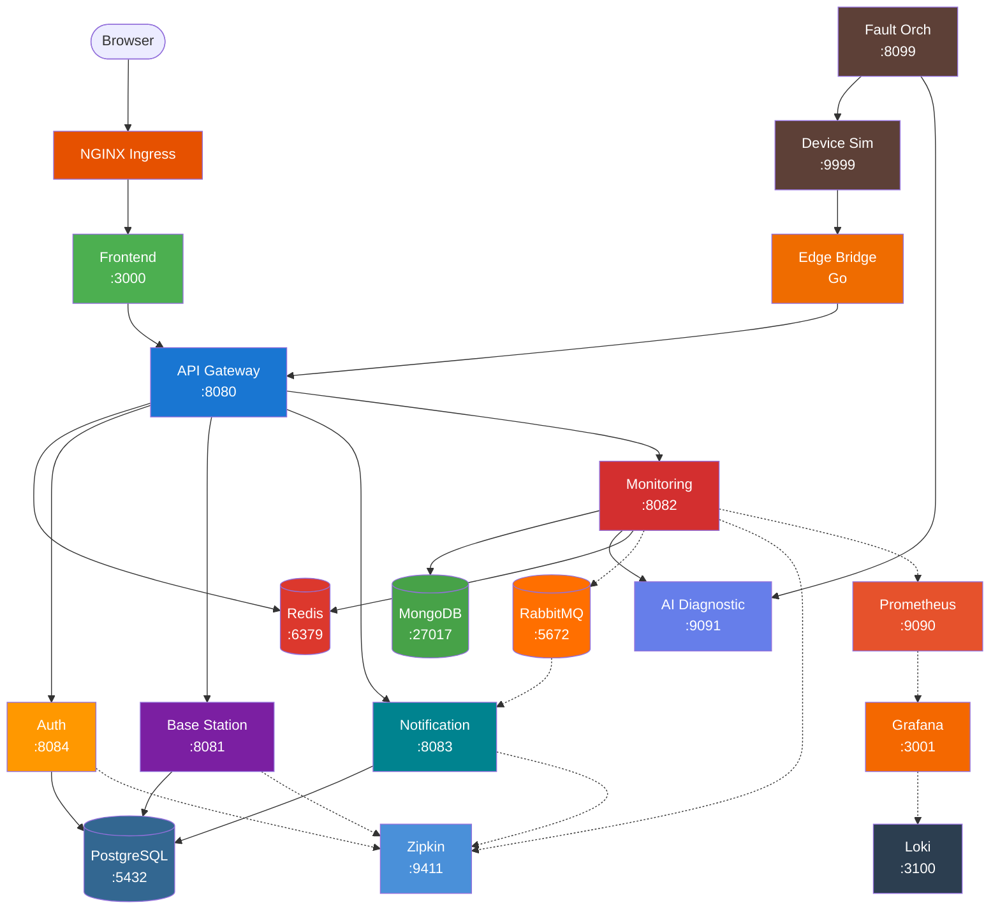

# Base Station Operations & Maintenance Platform


```mermaid
graph TD
    User([Browser]) --> Ingress[NGINX Ingress]
    Ingress --> FE[Frontend<br/>:3000]

    FS[Fault Orch<br/>:8099] --> DS[Device Sim<br/>:9999]
    DS --> EB[Edge Bridge<br/>Go]

    FE --> GW[API Gateway<br/>:8080]
    EB --> GW

    GW --> REDIS[(Redis<br/>:6379)]
    GW --> AS[Auth<br/>:8084]
    GW --> BS[Base Station<br/>:8081]
    GW --> NS[Notification<br/>:8083]
    GW --> MS[Monitoring<br/>:8082]

    AS --> PG[(PostgreSQL<br/>:5432)]
    BS --> PG
    NS --> PG
    MS --> MDB[(MongoDB<br/>:27017)]
    MS --> AI[AI Diagnostic<br/>:9091]
    MS --> REDIS
    MS -.-> RMQ[(RabbitMQ<br/>:5672)]
    RMQ -.-> NS
    FS --> AI
    AS & BS & NS & MS -.-> ZIP[Zipkin<br/>:9411]

    MS -.-> PROM[Prometheus<br/>:9090]
    PROM -.-> GRAF[Grafana<br/>:3001]
    GRAF -.-> LOKI[Loki<br/>:3100]

    style Ingress fill:#e65100,color:#fff
    style FE fill:#4caf50,color:#fff
    style GW fill:#1976d2,color:#fff
    style AS fill:#ff9800,color:#fff
    style BS fill:#7b1fa2,color:#fff
    style MS fill:#d32f2f,color:#fff
    style NS fill:#00838f,color:#fff
    style AI fill:#667eea,color:#fff
    style EB fill:#ef6c00,color:#fff
    style DS fill:#5d4037,color:#fff
    style FS fill:#5d4037,color:#fff
    style PG fill:#336791,color:#fff
    style MDB fill:#47a248,color:#fff
    style REDIS fill:#dc382d,color:#fff
    style RMQ fill:#ff6f00,color:#fff
    style PROM fill:#e6522c,color:#fff
    style GRAF fill:#f46800,color:#fff
    style LOKI fill:#2c3e50,color:#fff
    style ZIP fill:#4a90d9,color:#fff
```

<div align="center">

<p>
  <a href="https://github.com/ErselSeyit/base-station-platform/actions/workflows/ci.yml"></a>
  <a href="LICENSE"></a>
</p>

<p>
  
  
  
  
  
  
  
</p>

<p>
  
  
  
  
  
</p>

</div>

A full-stack microservices platform for 5G base station operations featuring AI-powered diagnostics, self-healing automation, and real-time monitoring.

---

## Quick Start

```bash
minikube start --memory=8192 --cpus=4
minikube addons enable ingress
helm install basestation helm/basestation-platform -n basestation-platform --create-namespace
# Dashboard: http://basestation.local:{ingress-port} (admin / password from K8s secret)
```

See [docs/QUICK_START.md](docs/QUICK_START.md) for setup details.

---

## Features

| Category | Capabilities |
|----------|--------------|
| **Monitoring** | 100 metric types, WebSocket streaming, Prometheus/Grafana |
| **AI Diagnostics** | 15+ ML models, anomaly detection, predictive maintenance |
| **SON** | MLB, MRO, CCO, Energy Saving with approval workflows |
| **Edge** | Go bridge for MIPS, C protocol library, SNMP/MQTT/NETCONF adapters |
| **Enterprise** | Multi-tenancy, TMF APIs (638/639/642), PagerDuty/Slack integrations |
| **Security** | JWT + RBAC, HMAC service auth, rate limiting, audit logging |

---

## Architecture

| Service | Port | Description |
|---------|------|-------------|
| Frontend | 3000 | React dashboard |
| API Gateway | 8080 | Routing, rate limiting, JWT |
| Auth Service | 8084 | Authentication, RBAC |
| Base Station | 8081 | Station CRUD, geospatial |
| Monitoring | 8082 | Metrics, WebSocket, SON |
| Notification | 8083 | Alerts via RabbitMQ |
| AI Diagnostic | 9091 | Python ML service |
| Edge Bridge | - | Go bridge for MIPS devices |

**Infrastructure:** PostgreSQL, MongoDB, Redis, RabbitMQ, Prometheus, Grafana, Zipkin

---

## Documentation

| Guide | Description |
|-------|-------------|
| [Quick Start](docs/QUICK_START.md) | Get running in 5 minutes |
| [Architecture](docs/ARCHITECTURE.md) | System design |
| [API Reference](docs/API.md) | REST endpoints |
| [Setup Guide](docs/SETUP.md) | Development setup |
| [Testing](docs/TESTING.md) | Test strategies |
| [Secrets](docs/SECRET_MANAGEMENT.md) | Production secrets |
| [Kubernetes](k8s/README.md) | K8s deployment |

---

## Development

```bash
mvn clean install              # Backend
cd frontend && npm run dev     # Frontend
cd edge-bridge && make build   # Edge Bridge
cd device-protocol-c && make   # C Library
```

---

## License

MIT - [LICENSE](LICENSE) | **Author:** Ersel Seyit
