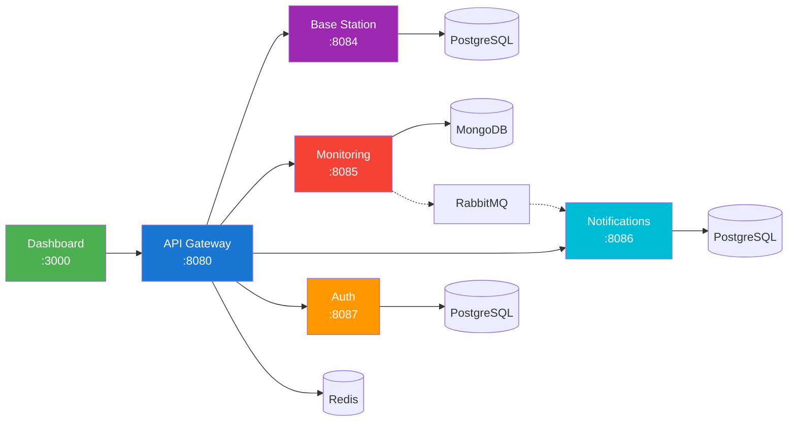

# Architecture Documentation

## System Overview

## Services

| Service | Port | Database | Purpose |
|---------|------|----------|---------|
| **Frontend** | 3000 | - | React dashboard with real-time updates |
| **API Gateway** | 8080 | Redis | Central routing, rate limiting, auth |
| **Eureka Server** | 8762 | - | Service discovery |
| **Base Station** | 8084 | PostgreSQL | Station CRUD, geo-search |
| **Monitoring** | 8085 | MongoDB | Real-time metrics, WebSocket streaming |
| **Notification** | 8086 | PostgreSQL | Alerts, notifications |
| **Auth** | 8087 | PostgreSQL | JWT authentication |

## Technology Stack

### Backend
| Technology | Version | Why |
|------------|---------|-----|
| **Java 21** | LTS | Virtual threads for high-concurrency WebSocket handling; records for immutable DTOs |
| **Spring Boot 3.4** | Latest | Auto-configuration reduces boilerplate; native observability with Actuator |
| **Spring Cloud Gateway** | 2024.0.x | Non-blocking reverse proxy; built-in rate limiting with Redis; JWT validation at edge |
| **Spring Data JPA/MongoDB** | - | Repository abstraction for polyglot persistence; query derivation reduces boilerplate |
| **Resilience4j** | 2.x | Lightweight circuit breakers; decorators integrate cleanly with Spring |

### Frontend
| Technology | Version | Why |
|------------|---------|-----|
| **React 18** | Latest | Concurrent rendering for smooth real-time updates; hooks for clean state management |
| **TypeScript** | 5.x | Compile-time type safety catches bugs early; better IDE support |
| **Material-UI** | 5.x | Production-ready components; consistent design system; accessibility built-in |
| **Recharts** | 2.x | Composable chart components; responsive by default |
| **React Query** | 5.x | Server state management with caching; automatic background refetching |

### Infrastructure
| Technology | Version | Why |
|------------|---------|-----|
| **PostgreSQL** | 18 | ACID transactions for station inventory; geospatial with PostGIS potential |
| **MongoDB** | 8.2 | Time-series optimized storage; horizontal scaling for high-volume metrics |
| **Redis** | 8 | Sub-millisecond rate limiting at gateway; could extend to session/cache |
| **RabbitMQ** | 4 | Reliable async messaging with DLQ; decouples alerting from notification delivery |

### DevOps
| Technology | Why |
|------------|-----|
| **Docker Compose** | Single-command local stack; mirrors production topology |
| **GitHub Actions** | Native GitHub integration; matrix builds for parallel testing |
| **Prometheus + Grafana** | Industry standard observability; PromQL for alerting rules |
| **Testcontainers** | Real databases in tests; no mocking data layer behavior |

## Design Decisions

### Why Microservices?

This project intentionally uses microservices to demonstrate:
- Service discovery with Eureka
- API gateway patterns (routing, rate limiting, auth)
- Polyglot persistence (right database for each use case)
- Async messaging for decoupled alerting
- Circuit breakers for resilience

For production MVP, starting with a modular monolith and extracting services only when scaling demands it is more appropriate. The microservices architecture here showcases patterns applicable selectively in production environments.

### Why Multiple Databases?

| Database | Service | Reason |
|----------|---------|--------|
| PostgreSQL | Stations, Auth, Notifications | ACID transactions, relational integrity |
| MongoDB | Metrics | Time-series optimized, high write throughput |
| Redis | Gateway | Sub-ms rate limiting lookups |

This demonstrates polyglot persistence where each store matches its workload.

## Key Features

### Real-Time Updates
- **WebSocket Streaming**: Live metrics pushed to dashboards
- **Event-Driven Alerts**: Automatic threshold monitoring via RabbitMQ
- **Auto-Refresh**: Charts update every 30 seconds

### Geographic Search
PostGIS-ready architecture for finding stations within radius (e.g., "find all stations within 10km").

### Resilience
- Circuit breakers prevent cascade failures
- Rate limiting at gateway protects backend services
- Retry logic for transient failures

## Observability

- **Metrics**: Prometheus scrapes `/actuator/prometheus` endpoints
- **Dashboards**: Grafana pre-configured with service health panels
- **Logs**: Centralized via Docker Compose logging driver
- **Tracing**: Zipkin for distributed tracing across microservices
