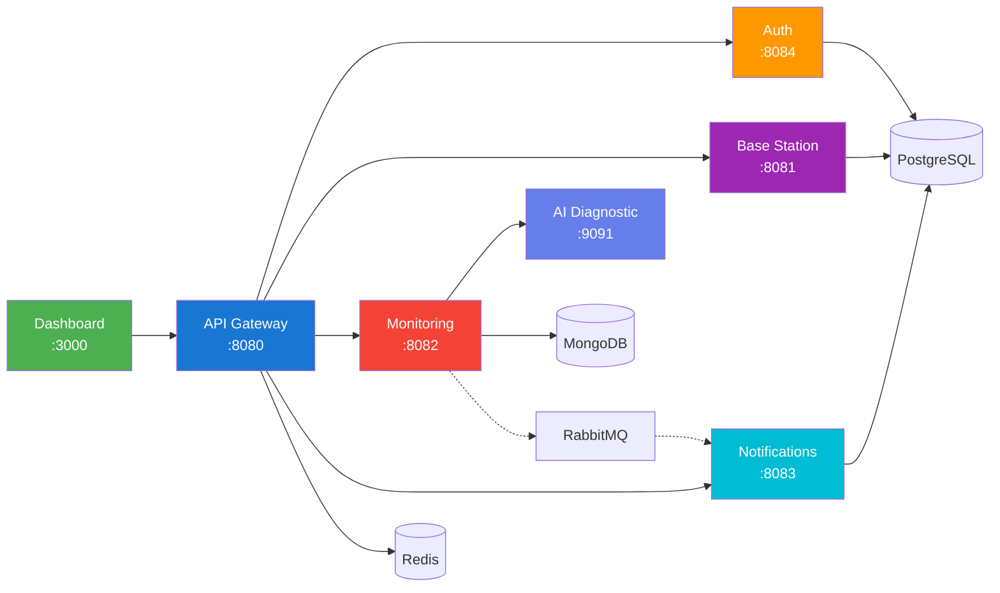

# Architecture Documentation

## System Overview



## Services

| Service | Port | Database | Purpose |
|---------|------|----------|---------|
| **Frontend** | 3000 | - | React dashboard with real-time updates |
| **API Gateway** | 8080 | Redis | Central routing, rate limiting, JWT validation |
| **Auth Service** | 8084 | PostgreSQL | JWT authentication, user management |
| **Base Station** | 8081 | PostgreSQL | Station CRUD, geospatial search |
| **Monitoring** | 8082 | MongoDB | Real-time metrics, WebSocket streaming |
| **Notification** | 8083 | PostgreSQL | Alerts, event-driven notifications |
| **AI Diagnostic** | 9091 | - | Python AI engine for problem detection |

## Service Discovery

The platform uses **Docker DNS** for service discovery (container names as hostnames). This approach:
- Eliminates Eureka overhead
- Simplifies deployment
- Works identically in Docker Compose and Kubernetes

Services reference each other by container name (e.g., `http://auth-service:8084`).

## Technology Stack

### Backend (Java)
| Technology | Version | Purpose |
|------------|---------|---------|
| **Java 21** | LTS | Virtual threads for high-concurrency WebSocket handling |
| **Spring Boot 3.4** | Latest | Auto-configuration, native observability with Actuator |
| **Spring Cloud Gateway** | 2024.0.x | Non-blocking reverse proxy, rate limiting, JWT validation |
| **Spring Data JPA/MongoDB** | - | Repository abstraction for polyglot persistence |
| **Resilience4j** | 2.x | Circuit breakers, retry logic |

### AI Service (Python)
| Technology | Version | Purpose |
|------------|---------|---------|
| **Python** | 3.12 | AI diagnostic engine |
| **FastAPI** | 0.115+ | Async HTTP server |
| **OpenTelemetry** | Latest | Distributed tracing with Zipkin |
| **HMAC Authentication** | - | Service-to-service security |

### Frontend
| Technology | Version | Purpose |
|------------|---------|---------|
| **React** | 18 | Concurrent rendering, hooks |
| **TypeScript** | 5.x | Compile-time type safety |
| **Material-UI** | 5.x | Component library |
| **TanStack Query** | 5.x | Server state management |
| **Recharts** | 2.x | Data visualization |
| **Leaflet** | 1.9+ | Interactive maps |
| **Framer Motion** | 11+ | Animations |

### Infrastructure
| Technology | Version | Purpose |
|------------|---------|---------|
| **PostgreSQL** | 18 | Consolidated database for stations, auth, notifications |
| **MongoDB** | 8.2 | Time-series metrics storage |
| **Redis** | 8 | Rate limiting, caching |
| **RabbitMQ** | 3.13 | Async messaging for alerts |
| **Prometheus** | Latest | Metrics collection |
| **Grafana** | Latest | Dashboards and visualization |
| **Zipkin** | Latest | Distributed tracing |

## Design Decisions

### Consolidated PostgreSQL

Previously used 3 separate PostgreSQL instances. Now consolidated to single instance with separate schemas:
- Reduces resource usage
- Simplifies backup/restore
- Appropriate for current scale

### Docker DNS vs Service Discovery

Removed Eureka service discovery in favor of Docker DNS:
- Container names serve as hostnames
- No additional infrastructure
- Works seamlessly with Docker Compose and Kubernetes

### AI Diagnostic Integration

Python AI service communicates with Java services via:
- HMAC-SHA256 authenticated REST API
- OpenTelemetry for distributed tracing
- Health checks via `/health` endpoint

## Key Features

### Real-Time Updates
- **WebSocket Streaming**: Live metrics pushed to dashboards
- **Event-Driven Alerts**: Automatic threshold monitoring via RabbitMQ
- **Auto-Refresh**: Charts update every 30 seconds

### AI Diagnostics
- Automated problem detection for temperature, CPU, memory, signal
- Confidence-scored remediation suggestions
- Device communication protocol for MIPS-based stations
- Real-time event visualization in frontend

### Geographic Search
PostGIS-ready architecture for geospatial queries (stations within radius).

### Resilience
- Circuit breakers prevent cascade failures
- Rate limiting at gateway (10 req/s, 20-token burst)
- Retry logic with exponential backoff

### Security
- Database-backed JWT authentication
- HMAC-SHA256 service-to-service auth
- Brute-force protection with account lockout
- Configurable CORS policies

## Observability

| Component | Purpose |
|-----------|---------|
| **Prometheus** | Scrapes `/actuator/prometheus` endpoints |
| **Grafana** | Pre-configured dashboards |
| **Zipkin** | Distributed tracing across services |
| **Structured Logging** | JSON logs with logstash-logback-encoder |
| **Health Checks** | Custom health indicators for dependencies |

## Container Overview

```
14 containers total:
- 6 application services (gateway, auth, base-station, monitoring, notification, frontend)
- 1 AI service (ai-diagnostic)
- 4 databases (postgres, mongodb, redis, rabbitmq)
- 3 observability (prometheus, grafana, zipkin)
```
