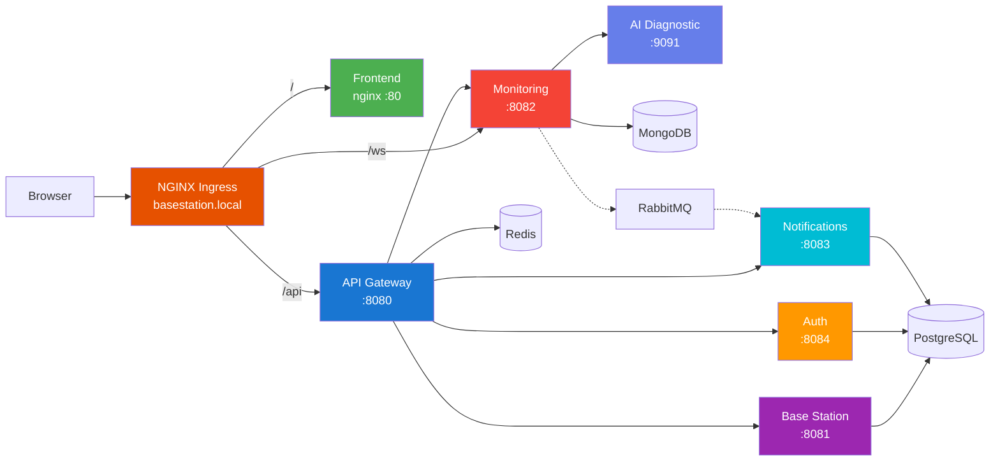

# Architecture Documentation

## System Overview


```mermaid
graph LR
    User[Browser]
    Ingress[NGINX Ingress<br/>basestation.local]
    Client[Frontend<br/>nginx :80]
    GW[API Gateway<br/>:8080]

    User --> Ingress
    Ingress -->|/| Client
    Ingress -->|/api| GW
    Ingress -->|/ws| MS

    GW --> AS[Auth<br/>:8084]
    GW --> BS[Base Station<br/>:8081]
    GW --> MS[Monitoring<br/>:8082]
    GW --> NS[Notifications<br/>:8083]

    MS --> AI[AI Diagnostic<br/>:9091]

    BS --> PG[(PostgreSQL)]
    AS --> PG
    NS --> PG
    MS --> MDB[(MongoDB)]

    GW --> Redis[(Redis)]
    MS -.-> RMQ[RabbitMQ]
    RMQ -.-> NS

    style Ingress fill:#e65100,color:#fff
    style GW fill:#1976d2,color:#fff
    style Client fill:#4caf50,color:#fff
    style BS fill:#9c27b0,color:#fff
    style MS fill:#f44336,color:#fff
    style NS fill:#00bcd4,color:#fff
    style AS fill:#ff9800,color:#fff
    style AI fill:#667eea,color:#fff
```

## Services

| Service | Port | Database | Purpose |
|---------|------|----------|---------|
| **Frontend** | 80 | - | React dashboard with real-time updates |
| **API Gateway** | 8080 | Redis | Central routing, rate limiting, JWT validation |
| **Auth Service** | 8084 | PostgreSQL | JWT authentication, user management |
| **Base Station** | 8081 | PostgreSQL | Station CRUD, geospatial search |
| **Monitoring** | 8082 | MongoDB, Redis | Real-time metrics, WebSocket streaming |
| **Notification** | 8083 | PostgreSQL | Alerts, event-driven notifications |
| **AI Diagnostic** | 9091 | - | Python AI engine for problem detection |

## Networking & Ingress

External traffic enters through **NGINX Ingress** on `basestation.local`:

| Ingress Path | Backend | Description |
|--------------|---------|-------------|
| `/` | frontend:80 | React SPA served by nginx |
| `/api` | api-gateway:8080 | REST API |
| `/ws` | monitoring-service:8082 | WebSocket streaming |

In the default single-domain ingress mode, `/api` routes directly to the API Gateway. The frontend nginx also has a proxy rule for `/api` used in Docker Compose mode.

## Service Discovery

The platform uses **Kubernetes DNS** for service discovery (service names as hostnames). This approach:
- Eliminates Eureka overhead
- Simplifies deployment
- Native to Kubernetes

Services reference each other by service name (e.g., `http://auth-service:8084`).

## Technology Stack

### Backend (Java)
| Technology | Version | Purpose |
|------------|---------|---------|
| **Java 21** | LTS | Virtual threads for high-concurrency WebSocket handling |
| **Spring Boot 3.4** | Latest | Auto-configuration, native observability with Actuator |
| **Spring Cloud Gateway** | 2024.0.x | Non-blocking reverse proxy, rate limiting, JWT validation |
| **Spring Data JPA/MongoDB** | - | Repository abstraction for polyglot persistence |
| **Resilience4j** | 2.x | Circuit breakers, retry logic |

### AI Service (Python)
| Technology | Version | Purpose |
|------------|---------|---------|
| **Python** | 3.12 | AI diagnostic engine |
| **Flask** | 2.3+ | HTTP server |
| **OpenTelemetry** | Latest | Distributed tracing with Zipkin |
| **HMAC Authentication** | - | Service-to-service security |

### Frontend
| Technology | Version | Purpose |
|------------|---------|---------|
| **React** | 18 | Concurrent rendering, hooks |
| **TypeScript** | 5.x | Compile-time type safety |
| **Material-UI** | 5.x | Component library |
| **TanStack Query** | 5.x | Server state management |
| **Recharts** | 2.x | Data visualization |
| **Leaflet** | 1.9+ | Interactive maps |
| **Framer Motion** | 12.x | Animations |

### Infrastructure
| Technology | Version | Purpose |
|------------|---------|---------|
| **PostgreSQL** | 18 | Consolidated database for stations, auth, notifications |
| **MongoDB** | 8 | Time-series metrics storage |
| **Redis** | 8 | Rate limiting, caching |
| **RabbitMQ** | 4 | Async messaging for alerts |
| **Prometheus** | Latest | Metrics collection |
| **Grafana** | Latest | Dashboards and visualization |
| **Zipkin** | Latest | Distributed tracing |

## Design Decisions

### Consolidated PostgreSQL

Previously used 3 separate PostgreSQL instances. Now consolidated to single instance with separate databases:
- Reduces resource usage
- Simplifies backup/restore
- Appropriate for current scale

### Kubernetes DNS vs Service Discovery

Removed Eureka service discovery in favor of Kubernetes DNS:
- Service names serve as hostnames within the cluster
- No additional infrastructure required
- NGINX Ingress handles external routing

### AI Diagnostic Integration

Python AI service communicates with Java services via:
- HMAC-SHA256 authenticated REST API
- OpenTelemetry for distributed tracing
- Health checks via `/health` endpoint

### Band-neutral Metric Model

Following the 3GPP model, a metric type is band-neutral (`DL_THROUGHPUT`,
`RSRP`, …) and the NR frequency band is a separate dimension on the reading
(`band: N28 | N78 | NONE`) rather than baked into the type name. The wire
protocol (C/Go/Python) encodes the band as a byte alongside each metric, and
`GET /api/v1/metrics/catalog` lists every type with its unit and 3GPP TS 28.552
counter. See [API.md](API.md#band-dimension-for-radio-metrics).

### TMF Open APIs (tmf-api)

The `tmf-api` module implements TM Forum Open APIs (TMF638/639/642) and is
built and tested in the Maven reactor, but is **not yet wired into the default
`docker compose`/Helm deployment** (no Dockerfile/compose entry). Its security
is already hardened to the gateway-fronted model above for when it is deployed.

## Key Features

### Real-Time Updates
- **WebSocket Streaming**: Live metrics pushed to dashboards
- **Event-Driven Alerts**: Automatic threshold monitoring via RabbitMQ
- **Auto-Refresh**: Charts update every 30 seconds

### AI Diagnostics
- Automated problem detection for temperature, CPU, memory, signal
- Confidence-scored remediation suggestions
- Device communication protocol for MIPS-based stations
- Real-time event visualization in frontend

### Geographic Search
PostGIS-ready architecture for geospatial queries (stations within radius).

### Resilience
- Circuit breakers prevent cascade failures
- Rate limiting at gateway (per-endpoint, e.g., auth 10 req/s, monitoring 100 req/s)
- Retry logic with exponential backoff

### Security
- Database-backed JWT authentication
- **Gateway-fronted trust model**: the API Gateway validates the JWT, then
  forwards the user identity in `X-User-Name`/`X-User-Role` headers. Downstream
  services build their `Authentication` from those headers, but only trust them
  because `InternalAuthFilter` (in `common`) first verifies an `X-Internal-Auth`
  HMAC-SHA256 signature — so a client cannot spoof `X-User-Role: ADMIN` by
  calling a service directly. Services must scan the `common` package for this
  filter to register.
- Brute-force protection with account lockout
- Configurable CORS policies

## Observability

| Component | Purpose |
|-----------|---------|
| **Prometheus** | Scrapes `/actuator/prometheus` (permitted for scraping; the rest of `/actuator` is admin-only) |
| **Grafana** | Pre-configured dashboards |
| **Zipkin** | Distributed tracing across services |
| **Structured Logging** | JSON logs with logstash-logback-encoder |
| **Health Checks** | Custom health indicators for dependencies |

## Deployment Overview

Deployed on Kubernetes (minikube) via Helm:

```
19 pods total:
- 6 application services (gateway, auth, base-station, monitoring, notification, frontend)
- 1 AI service (ai-diagnostic)
- 2 simulators (anomaly-simulator, device-simulator)
- 1 edge bridge (Go)
- 4 databases (postgres, mongodb, redis, rabbitmq)
- 5 observability (prometheus, grafana, zipkin, loki, promtail)
```

External access via NGINX Ingress at `basestation.local`.
